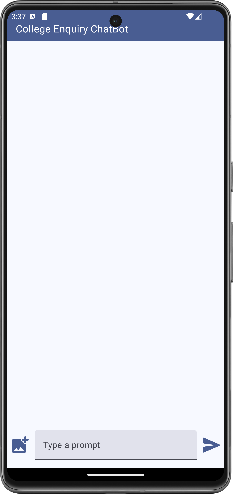
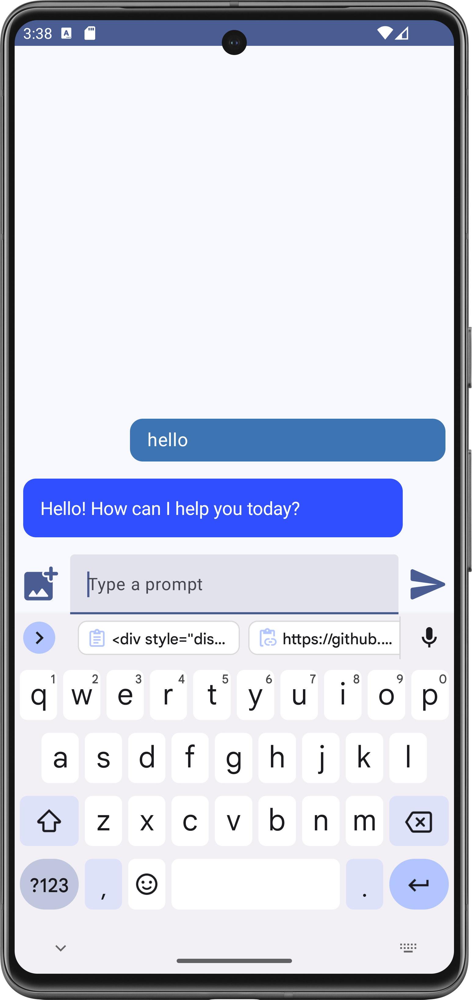
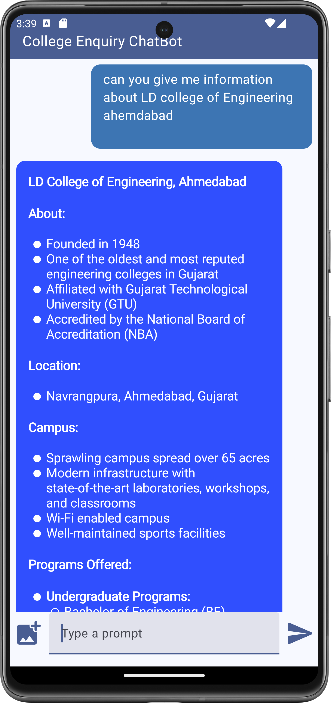

# CEChatBot

CEChatBot is an Android application that serves as a chatbot for college inquiries. It allows users to interact with a conversational AI to get information about colleges.

## Features

- **Chat Interface**: Users can communicate with the chatbot through a messaging interface.
- **Image Support**: Users can send images along with their queries for a better understanding.
- **Responsive Design**: The app is designed to work seamlessly across various screen sizes.

## Tech Stack

- **Language**: Kotlin
- **Architecture**: MVVM (Model-View-ViewModel)
- **Libraries**:
  - Coil for image loading
  - Jetpack Compose for UI
  - Kotlin Coroutines for asynchronous programming
  - Generative AI client for AI interactions

## Screenshots

  
  
  

## Installation

To run the project locally, follow these steps:

1. Clone this repository.
2. Open the project in Android Studio.
3. Build and run the project on an emulator or a physical device.

## Usage

- Upon launching the app, users are greeted with a chat interface.
- Users can type their queries into the text field and send them to the chatbot.
- Images can be attached by clicking on the camera icon.
- The chatbot responds with relevant information based on the queries.

## Contributing

Contributions are welcome! Here's how you can contribute:

1. Fork the repository.
2. Create a new branch (`git checkout -b feature`)
3. Make your changes
4. Commit your changes (`git commit -am 'Add new feature'`)
5. Push to the branch (`git push origin feature`)
6. Create a pull request

## Author

Jayesh Ahir

